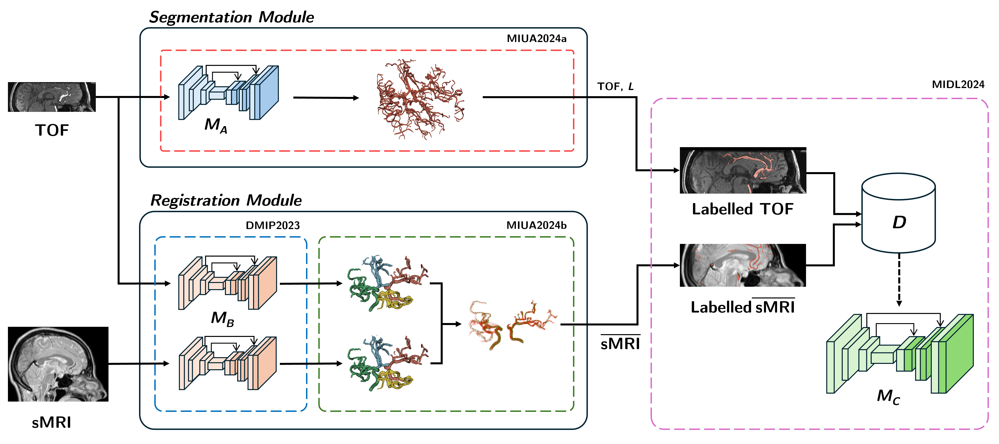

# Segmentation and Registration of Cerebral Arteries in Structural MRI

_Figure 1: Segmentation results on both the IXI and TubeTK datasets for angiographic and structural MR sequences._

## About
This repository comprises our results and code for the methods for **segmentation and registration** of cerebral arteries described in the following publications:

* _[[MIDL2024](midl2024%2FREADME.md)]_ **Brain Artery Segmentation for Structural MRI**\
**Accepted** at Medical Imaging with Deep Learning (MIDL) Conference 2024\
 Full Reference: `Sabrowsky-Hirsch, B., AlShenoudy, A., Thumfart, S., Giretzlehner, M., & Scharinger, J. (2024). Brain Artery Segmentation for Structural MRI. In Medical Imaging with Deep Learning. OpenReview.`

* _[[MIUA2024a](miua2024a%2FREADME.md)]_ **Towards Segmenting Cerebral Arteries from Structural MRI** [Under construction]\
**Accepted** at Medical Image Understanding and Analysis (MIUA) Conference 2024\
 Full Reference: `Alshenoudy, A., Sabrowsky-Hirsch, B., Scharinger, J., Thumfart, S., Giretzlehner, M.. (2024). Towards Segmenting Cerebral Arteries from Structural MRI. 28th UK Conference on Medical Image Understanding
and Analysis (MIUA 2024). Springer Nature.`

* _[[MIUA2024b](miua2024b%2FREADME.md)]_ **Robust Multi-Modal Registration of Cerebral Vasculature** [Under construction]\
**Accepted** at Medical Image Understanding and Analysis (MIUA) Conference 2024\
 Full Reference: `Sabrowsky-Hirsch, B., Alshenoudy, A., Scharinger, J., Gmeiner, M., Thumfart, S., Giretzlehner, M.. (2024). Robust Multi-Modal Registration of Cerebral Vasculature. 28th UK Conference on Medical Image Understanding
and Analysis (MIUA 2024). Springer Nature.`

Please find more details on the respective subfolder linked for each publication. \
For our previous work on the **anatomical annotation** of cerebral arteries, refer to our previous [repository](https://github.com/risc-mi/cerebral-artery-annotation).

_Figure 2: Overview of MIDL2024 method and respective submodules employed from our other publications._

## Contact

If you have any inquiries, please open a GitHub issue.

## Acknowledgements

This project is financed by research subsidies granted by the government of Upper Austria. RISC Software GmbH is Member of UAR (Upper Austrian Research) Innovation Network.
