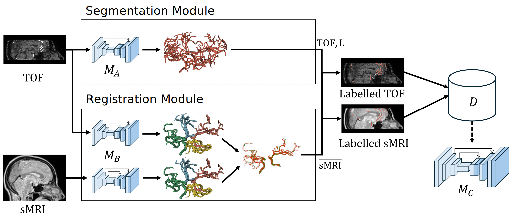
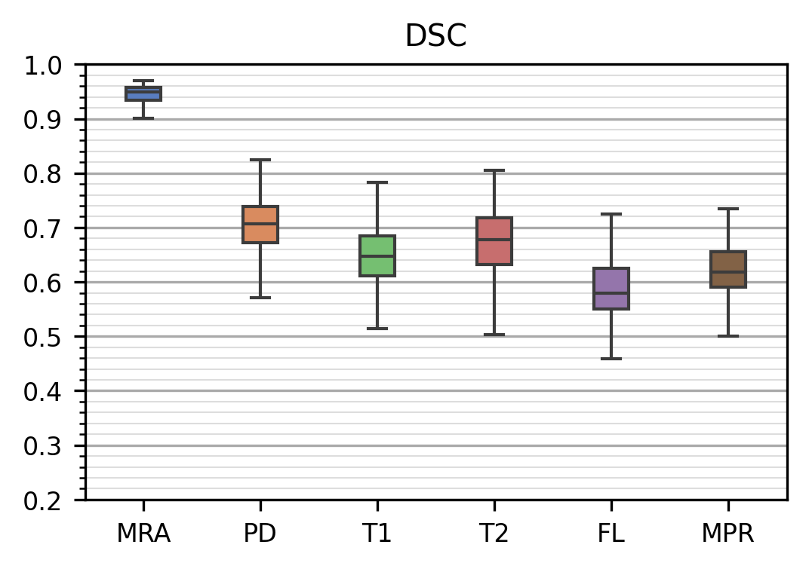

# Brain Artery Segmentation for Structural MRI


_Figure 1: Results of our segmentation method for different structural MRI sequences: 
The predictions are illustrated with DSC scores for the full (top) and Circle of Willis (CoW) region (bottom) of an exemplar patient of 
IXI (TOF, PD, T1 and T2) and TubeTK (FL and MPR). Oversegmentation is shown in magenta and undersegmented ground-truth in light-blue._

## About

In this project, we share code and results on our proposed method for the segmentation of brain arteries in structural MR images (sMRI).
The delineation of brain arteries in sMRI poses a significant challenge due to the lack of contrast, which we address through our automatic segmentation method.

Our fully automated strategy leverages two modules:
- Segmentation module: generates pseudo labels from angiographic TOF MR images using model **M<sub>A</sub>** published in [MIUA2024a](..%2Fmiua2024a%2FREADME.md).
- Registration module: pairs these labels with sMRI images using model **M<sub>B</sub>** and a geometric registration method published in [MIUA2024b](..%2Fmiua2024b%2FREADME.md).

The process constructs the dataset used to train the final improved segmentation model **M<sub>C</sub>**. 
In our experiments conducted on data of [IXI](https://brain-development.org/ixi-dataset/) and [TubeTK](https://public.kitware.com/Wiki/TubeTK/Data), our model achieved an average Dice Similarity Coefficient (DSC) of 0.66 across all 
sMRI around the central Circle of Willis structure in a 5-fold cross validation. Out of sMRI sequences which we identified  **PD** with a DSC of 0.7 as the best alternative 
to angiographic images. Please refer to our [publication](#References) if you are interested in the details.


_Figure 2: Overview of our method._

## How to use


Our work fully relies on the nnU-Net framework for training and inference. You can
checkout their [Github](https://github.com/MIC-DKFZ/nnUNet) repository or install the package from [PyPI](https://pypi.org/project/nnunetv2/):
```pip install nnunetv2```. However, be careful to set up Pytorch correctly for your system before installing nnU-Net. 
For more information, check the [nnU-Net Instructions](https://github.com/MIC-DKFZ/nnUNet/blob/master/documentation/installation_instructions.md).

### Inference using our pretrained model

We provide pretrained weights for model **M<sub>C</sub>** at [Google Drive](https://drive.google.com/drive/folders/10r7tYcAYhvw3ZpFkX6d65oo9U3GK7mpy?usp=sharing).
You can use our models with the nnU-Net framework to generate predictions for your data:

1. First download and extract the models to a folder `<path-to/models>`.
2. Store the images (we recommend using the .nii.gz format) at a folder `<path-to/input>`.\
The filenames should follow the format `<name>_0000.nii.gz`, e.g. 'pat01pd_0000'.\
**Note**: The postfix `_0000` is used by nnU-Net to identify channels and should always be present.
3. Create your output folder `<path-to/output>`.
4. Activate your python environment. Make sure nnU-Net is set up accordingly.
5. In the environment prompt, run ```nnUNetv2_predict_from_modelfolder -m "<path-to/models>" -i "<path-to/input>" -o "<path-to/output>"```

**Note**: It is worth checking the image orientation (as in the cosine orientation matrix), as it is sometimes incorrectly interpreted by nnU-Net. 
The models are not orientation-agnostic and will produce inferior results if the orientation of the input does not match the standard patient orientation. We found preprocessing the images with SimpleITK.DICOMOrient, using 'RAI' as the reference orientation to convert to, to be sufficient.

### Reproduce our pretrained model

The following steps indicate how to reproduce the dataset used for the training of model **M<sub>C</sub>**.

1. Download the data of the public [IXI](https://brain-development.org/ixi-dataset/) and [TubeTK](https://public.kitware.com/Wiki/TubeTK/Data) datasets.
2. Next, you will need to reproduce ground-truth labels **L** and resampled **<u>sMRI</u>** for the scans.\
You can skip the sub-steps by using the prepared dataset shared through our [Google Drive](https://drive.google.com/open?id=1QKGcTAXMGPUOf_rainMWpqzkdAB-EBMf&usp=drive_fs).
   * for TOF MRA, use model **M<sub>A</sub>** published [MIUA2024a](..%2Fmiua2024a%2FREADME.md) to predict labels.
   * for the other MR sequences use our method [MIUA2024b](..%2Fmiua2024b%2FREADME.md) to register and resample them to their respective TOF MRA scan. 
     * You can skip this step by using our prepared ITK transforms shared via [Google Drive](https://drive.google.com/open?id=1QKeT1asXAswLx67GKCcpGCGba-hXU1Vv&usp=drive_fs). In this case, simply use the forward.hdf for each scan to resample the scans to respective TOF MRA. 
3. Build the nnU-Net dataset **D** for the training of **M<sub>C</sub>**:
   * create your dataset folder, e.g., `Dataset505_ArterySMRI`
   * copy the TOF MRA to a folder `/imagesTr` and rename to match the following pattern: `<name>-MRA_0000.nii.gz`, e.g., `IXI002-Guys-0828-MRA_0000.nii.gz`
   * copy the pseudo labels to a folder `/labelsTr` and rename to match the following pattern: `<name>-MRA.nii.gz`, e.g., `IXI002-Guys-0828-MRA.nii.gz`
   * copy the resampled sMRI to the `/imagesTr` folder and rename to match following pattern: `<name>-<seq>_0000.nii.gz`, e.g., `IXI002-Guys-0828-PD_0000.nii.gz`
   * duplicate the pseudo label for each sMRI in the `/imagesTr` folder, e.g., for `IXI002-Guys-0828-PD.nii.gz` copy `IXI002-Guys-0828-MRA.nii.gz`
   * add the dataset.json and use the splits_final.json shared through the Google Drive link above.
4. Use the nnU-Net framework to train the model on your dataset. For this, please refer to the detailed [instructions](https://github.com/MIC-DKFZ/nnUNet/blob/master/documentation/how_to_use_nnunet.md) at the nnU-Net repository.

### Reproduce evaluation results

Our evaluation comprised DSC scores for each validation result. When training the model, nnU-Net will automatically create predictions
for each validation scan of each fold in a folder `\Dataset505_VesselsNAMRI\nnUNetTrainer__nnUNetPlans__3d_fullres\fold_0\validation`.\
Proceed as follows:
- for the full image DSC score, simply calculate the DSC score between the prediction in `/foldX/validation` and the label in `/labelsTr`.
- for the CoW region DSC score, first mask both the prediction and label using the CoW mask, before calculating the DSC score.\
The CoW mask for each scan be reproduced through the following steps:
  - first register each scan to MNI space using the [ICMB152 Nonlinear Symmetric Atlas](https://www.bic.mni.mcgill.ca/ServicesAtlases/ICBM152NLin2009) (2009b), e.g. using [ANTs](https://github.com/ANTsX/ANTsPy).
  - use the resulting transform to resample the mask [MNI_eval_roi](resource%2FMNI_eval_roi.nrrd) to each scan.
  - prepared masks are shared through our [Google Drive](https://drive.google.com/open?id=1QL4Kr3pis0WiN2k3RGxE-t5knvvosv_b&usp=drive_fs).

For direct comparison, the evaluation results reported in our publications are summarized in:
- full image region: [Results](resource%2Fval_dsc_full.xlsx), [Plot](resource%2Fval_dsc_full.png).
- cow image region: [Results](resource%2Fval_dsc_cow.xlsx), [Plot](resource%2Fval_dsc_cow.png).



_Figure 3: Evaluated DSC scores for the CoW region, grouped by MR Sequence (MRA => TOF MRA)._


## References

Our paper is available through [OpenReview](https://openreview.net/forum?id=KXmiNZYuBR). We also share the [poster](poster.pdf) presented at the MIDL 2024 conference in Paris.

If you use our results in your research, we would appreciate you citing the following conference paper:

* `Sabrowsky-Hirsch, B., AlShenoudy, A., Thumfart, S., Giretzlehner, M., & Scharinger, J. (2024). Brain Artery Segmentation for Structural MRI. In Medical Imaging with Deep Learning. OpenReview`

## Acknowledgements

<div style="background-color:white;padding: 1em">


</div>

This project is financed by research subsidies granted by the government of Upper Austria. RISC Software GmbH is Member of UAR (Upper Austrian Research) Innovation Network.
